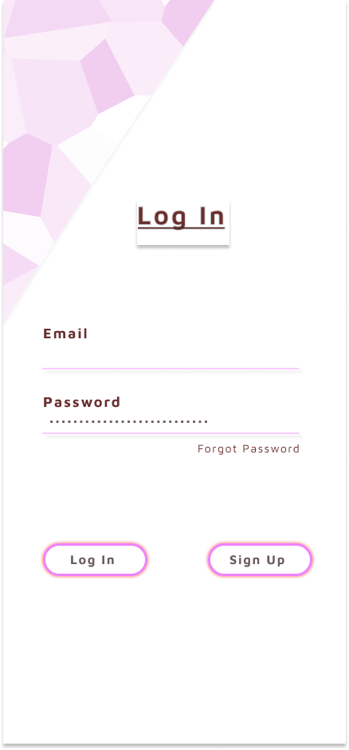
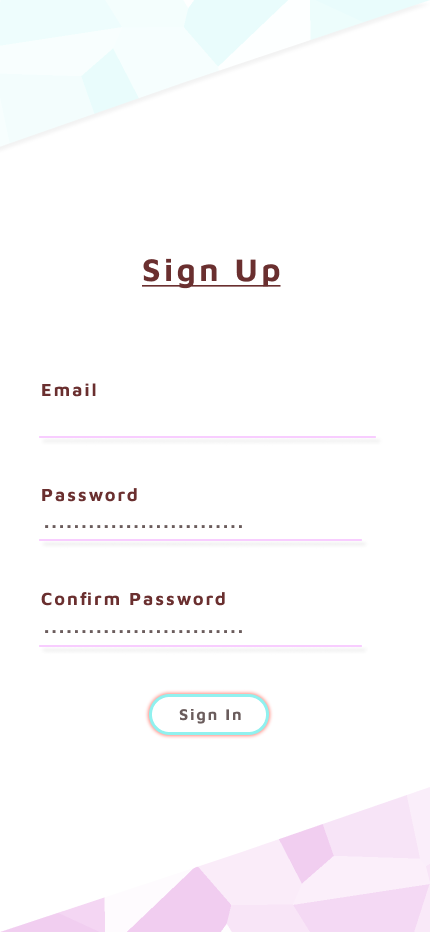
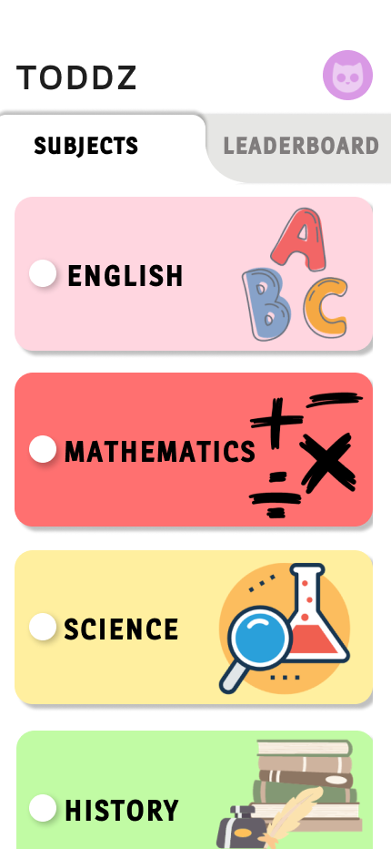
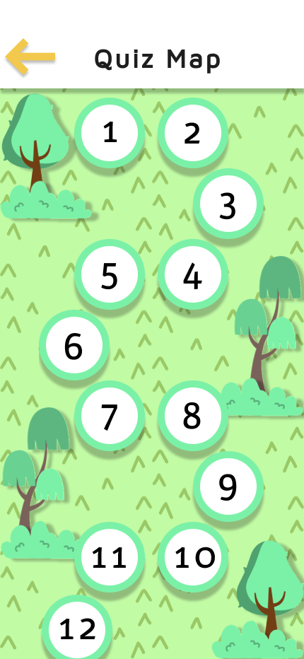
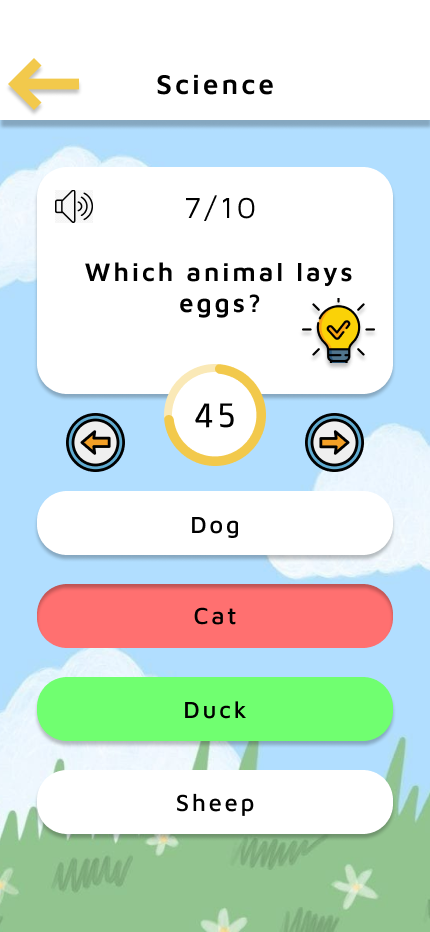
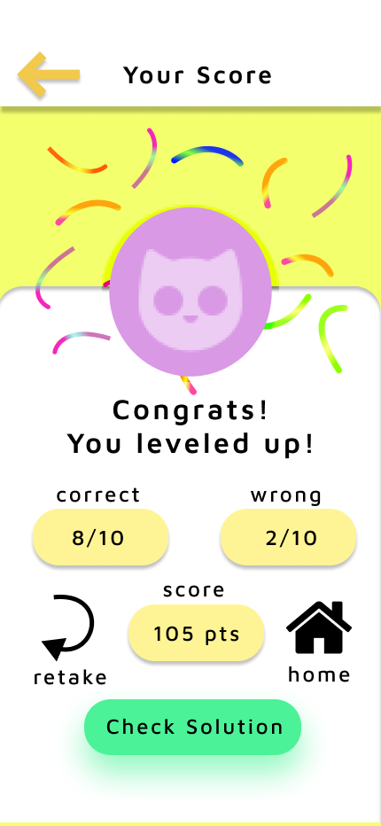
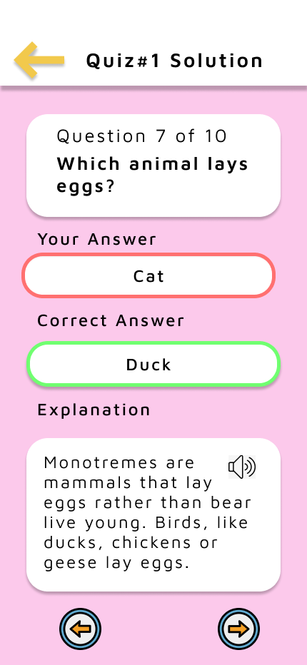
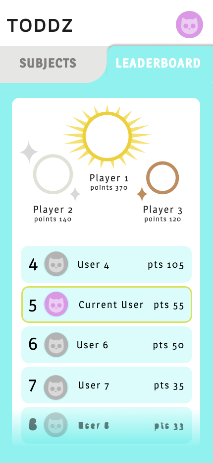
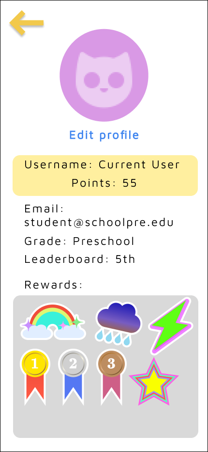
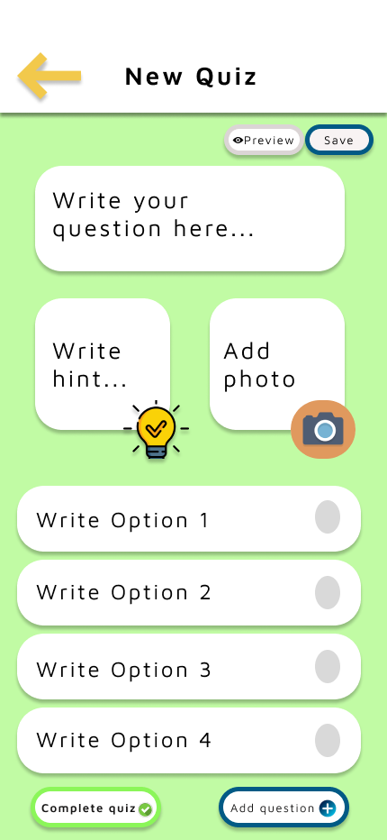

## ToddzEducation

ToddzEducation is a frontend mobile application developed as a project for the Human-Computer Interaction course. Toddz provides an educational platform designed for young children aged 5-12 years, with a strong emphasis on accessibility for visual and hearing impairments.

## Features
- Age-Appropriate Content Tailored content suitable for children aged 5-12.
- Accessibility Designed with features to support visual and hearing aids.
- Interactive Learning Leaderboard to enhance learning experience.

## Technologies Used
- Frontend Java, XML, Figma

## Acknowledgements
- Developed in collaboration with Takreem Jaffery, Mehak Khurram, Aneeza Junaid, and Raffat Hassan.

### Screenshots

